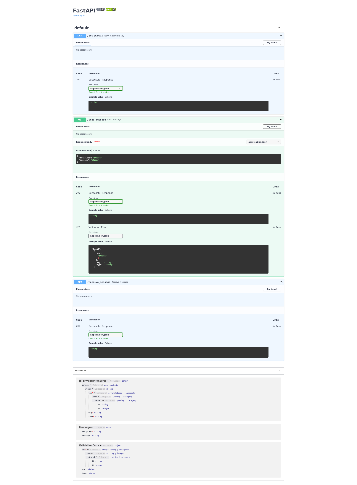

- Just a little reminder:
    - To run the Kafka service, run the following commands in your terminal

        - sudo systemctl start zookeeper
        - sudo systemctl start kafka
        - sudo systemctl status zookeeper
        - sudo systemctl status kafka

    - To stop the kafka services:
        - sudo systemctl stop kafka
        - sudo systemctl stop zookeeper

 
 

---

 
 

