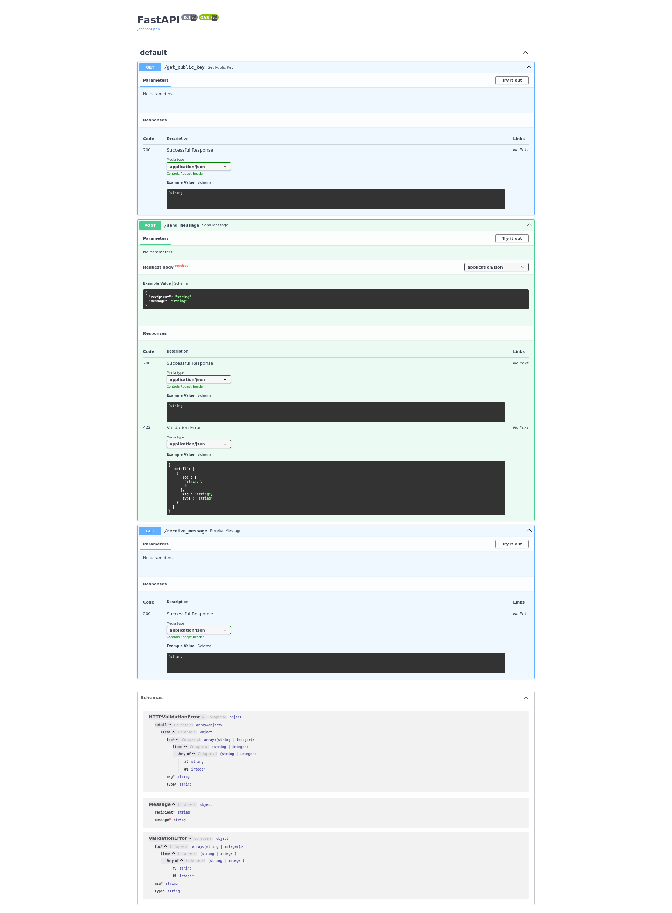

# Mıdterm Case:
- **Secure Communication Practice**

    - **Objective:** 
    Understand the principles of secure communication.

    - **Tasks:** 
    Students use secure messaging apps (such as Signal or WhatsApp) to communicate
    and discuss the encryption protocols these apps use (e.g., end-to-end encryption). They present on how these apps ensure the privacy and security of communications.

---

**Şifreleme Algoritmaları:**

Şifreleme algoritmaları, verilerin güvenli bir şekilde iletilmesini ve saklanmasını sağlayan matematiksel işlemlerdir. İletilen verilerin sadece alıcı tarafından anlaşılmasını sağlarlar ve kötü niyetli kişilerin verilere erişmesini engellerler. İşte en yaygın kullanılan şifreleme algoritmalarından bazıları:

1. **Simetrik Şifreleme Algoritmaları:** Bu algoritmalar, aynı anahtarın hem şifreleme hem de deşifreleme işlemlerinde kullanıldığı bir sistemdir. Veriyi şifrelemek ve deşifrelemek için aynı anahtar kullanılır. Örneğin, AES (Advanced Encryption Standard) ve DES (Data Encryption Standard) gibi algoritmalar simetrik şifreleme algoritmalarına örnektir.

2. **Açık Anahtarlı (Asimetrik) Şifreleme Algoritmaları:** Bu algoritmalar, iki farklı anahtarın kullanıldığı bir sistemdir: biri veriyi şifrelemek için (açık anahtar) ve diğeri deşifrelemek için (özel anahtar). Veriyi göndermeden önce alıcının açık anahtarını kullanarak şifrelenir, ancak sadece alıcının özel anahtarıyla çözülebilir. RSA (Rivest-Shamir-Adleman) bu tür bir algoritmadır.

---
### RSA Nedir? (Rivest-Shamir-Adleman):
- **Tanım**: RSA, bir asimetrik (genel anahtar) şifreleme algoritmasıdır. 1977'de Ron Rivest, Adi Shamir ve Leonard Adleman tarafından geliştirilmiştir.
- **Çalışma Prensibi**: RSA, iki farklı anahtar kullanır: bir genel anahtar ve bir özel anahtar. Genel anahtar, herkes tarafından kullanılabilir ve veri şifrelemek için kullanılır. Özel anahtar ise gizli tutulur ve şifrelenmiş verinin çözülmesi için kullanılır.
- **Kullanım Alanları**: RSA, genellikle güvenli veri iletimi, dijital imzalar ve sertifika yönetimi gibi alanlarda kullanılır.
- **Güvenlik**: RSA, büyük asal sayılarla çalışır ve bu nedenle yüksek güvenlik sağlar. Ancak, büyük anahtar boyutları gerektirir ve bu da işlem hızını yavaşlatabilir.

### AES Nedir? (Advanced Encryption Standard):
- **Tanım**: AES, bir simetrik şifreleme algoritmasıdır. Bu, hem şifreleme hem de şifre çözme işlemleri için aynı anahtarı kullandığı anlamına gelir. AES, 2001 yılında NIST (National Institute of Standards and Technology) tarafından kabul edilmiş ve standart olarak belirlenmiştir.
- **Çalışma Prensibi**: AES, 128-bit, 192-bit veya 256-bit uzunluğunda anahtarlarla çalışır. Veri, belirli blok boyutlarında (genellikle 128-bit) işlenir ve bir dizi karmaşık işlemlerden geçirilir (örn. karıştırma, değiştirme, dönme ve XOR işlemleri).
- **Kullanım Alanları**: AES, verilerin hızlı ve verimli bir şekilde şifrelenmesini sağlar. Bu nedenle, dosya şifreleme, ağ trafiği güvenliği ve disk şifreleme gibi birçok alanda kullanılır.
- **Güvenlik**: AES, günümüzün en güvenli ve sağlam şifreleme algoritmalarından biridir. Kırılması çok zor olan yüksek derecede güvenlik sağlar ve iyi bir performans sunar.

Sonuç olarak, RSA ve AES farklı şifreleme ihtiyaçlarını karşılamak için kullanılan iki önemli algoritmadır. RSA, anahtar dağıtımı ve dijital imzalar gibi alanlarda kullanılırken, AES hızlı ve güvenli veri şifrelemesi sağlar. Bu nedenle, birçok uygulama bu iki algoritmayı bir arada kullanarak veri güvenliğini ve hızını optimize eder.

--- 

**RSA ve AES Şifrelemeleri:**

- **RSA Şifrelemesi:**
   - RSA, açık anahtarlı bir şifreleme algoritmasıdır.
   - İki anahtar kullanır: açık anahtar ve özel anahtar.
   - Açık anahtar, veriyi şifrelemek için kullanılır ve herkes tarafından bilinir.
   - Özel anahtar, veriyi deşifrelemek için kullanılır ve sadece alıcının bilir.
   - Veri, alıcının açık anahtarıyla şifrelenir ve sadece alıcının özel anahtarıyla çözülebilir.

- **AES Şifrelemesi:**
   - AES, simetrik bir şifreleme algoritmasıdır.
   - Aynı anahtar hem şifreleme hem de deşifreleme işlemlerinde kullanılır.
   - Veri, belirli bir anahtarla şifrelenir ve aynı anahtarla deşifrelenir.
   - Anahtarın güvenliği, verinin güvenliği için kritiktir; bu nedenle anahtarın güvenliği sağlanmalıdır.

**Neden RSA ve AES'i Seçtik?**

- **RSA:**
  - Anahtar değişimi için kullanılır: RSA, açık anahtarlı bir şifreleme algoritması olduğu için güvenli anahtar değişimi sağlar. Bu özellik, iletişimdeki taraflar arasında güvenli bir şekilde anahtarların paylaşılmasını sağlar.
  - Güvenilirlik: RSA, güvenilir ve yaygın olarak kullanılan bir şifreleme algoritmasıdır. Güçlü bir matematiksel temele dayanır ve geniş çapta kabul görmüştür.

- **AES:**
  - Hızlı ve etkili: AES, simetrik şifreleme algoritmaları arasında hızlı ve etkilidir. Verileri hızlı bir şekilde şifreler ve deşifreler, bu da iletişimde gecikme olmamasını sağlar.
  - Güvenlik: AES, güçlü bir güvenlik seviyesi sunar. Doğru anahtar yönetimi ile kullanıldığında, verilerin güvenliğini sağlamak için güvenilir bir seçenektir.

Bu nedenlerden dolayı, RSA ve AES gibi şifreleme algoritmalarını tercih ettik. RSA, anahtar değişimi için güvenli bir seçenek sunarken, AES hızlı ve güvenli veri şifreleme sağlar. Bu iki algoritma birlikte kullanıldığında, iletişimdeki verilerin güvenliğini ve gizliliğini sağlamak için güçlü bir kombinasyon oluştururlar.

---

### Kod İerisindeki Kullanımlar

- **AES Kullanımı:**
    - `encrypt_message` fonksiyonunda, `os.urandom()` fonksiyonu kullanılarak rastgele bir simetrik anahtar (symmetric_key) ve başlangıç vektörü (IV) oluşturuluyor.
    - Ardından, `Cipher` sınıfı kullanılarak AES algoritmasıyla bir şifreleme nesnesi (`cipher`) oluşturuluyor. Bu nesne, simetrik anahtar ve başlangıç vektörü kullanılarak AES-CFB modunda oluşturuluyor.
    - `encryptor` nesnesi (`cipher.encryptor()`) ile mesaj şifreleniyor.
    - Şifrelenmiş mesaj ve simetrik anahtar `recipient_public_key` ile RSA kullanılarak şifreleniyor.

- **RSA Kullanımı:**
    - Simetrik anahtar (`symmetric_key`) ve şifreli mesaj, alıcının açık anahtarı (`recipient_public_key`) ile RSA kullanılarak şifreleniyor.
    - Şifrelenmiş anahtar ve şifrelenmiş mesaj bir araya getirilip JSON formatında paketleniyor.

Yani, kodda mesajın kendisi AES algoritması ile şifreleniyor. Ancak bu şifreli mesajın güvenli bir şekilde iletilebilmesi için simetrik anahtar RSA algoritması ile şifreleniyor. Bu sayede, hem AES'in yüksek hız ve verimliliği hem de RSA'nın güvenli anahtar paylaşım özelliklerinden yararlanılmış oluyor.

---

### Adımlar:
Aşağıdaki kodda mesajları güvenli bir şekilde iletmek için kullanılan süreci detaylı olarak açıklayacağım. Kodda hem RSA hem de AES şifreleme algoritmaları bir arada kullanılmıştır. Bu kombinasyonun amacı, verilerin güvenli bir şekilde iletilmesini ve şifrelenmesini sağlamaktır.

1. **RSA ve AES Kullanımı**:
    - Kod, RSA ve AES algoritmalarının kombinasyonunu kullanmaktadır. AES, simetrik şifreleme algoritmasıdır ve mesajın kendisini şifrelemek için kullanılır. RSA ise asimetrik bir algoritmadır ve simetrik anahtarın güvenli bir şekilde iletilmesi için kullanılır.
    
2. **RSA Anahtar Üretimi**:
    - `get_public_key` fonksiyonunda, RSA algoritması kullanılarak özel ve genel anahtar çifti oluşturuluyor. `rsa.generate_private_key` fonksiyonu ile 2048 bitlik bir özel anahtar (`private_key`) oluşturuluyor. Özel anahtarın genel anahtarı `private_key.public_key()` ile elde ediliyor.
    - `private_pem` ve `public_pem` değişkenleri, sırasıyla özel ve genel anahtarların PEM formatında seri hale getirilmiş hallerini içeriyor.
    - `server_private_key` global değişkeni, oluşturulan özel anahtarı saklamak için kullanılıyor.

3. **Mesaj Şifreleme**:
    - `encrypt_message` fonksiyonunda, mesajı şifrelemek için AES algoritması kullanılıyor.
    - İlk olarak, `os.urandom()` fonksiyonları ile 32 byte'lık rastgele bir simetrik anahtar (`symmetric_key`) ve 16 byte'lık bir başlangıç vektörü (`iv`) oluşturuluyor.
    - `Cipher` sınıfı kullanılarak AES-CFB modunda bir şifreleme nesnesi (`cipher`) oluşturuluyor.
    - `encryptor` nesnesi ile mesaj (`message`) AES algoritması kullanılarak şifreleniyor.
    
4. **Simetrik Anahtarın RSA ile Şifrelenmesi**:
    - Şifrelenmiş mesajı ve simetrik anahtarı güvenli bir şekilde iletmek için, simetrik anahtar alıcının genel anahtarı (`recipient_public_key`) ile RSA kullanılarak şifreleniyor.
    - `recipient_public_key.encrypt` fonksiyonu, `symmetric_key`'yi şifrelemek için kullanılıyor.
    
5. **Paketleme**:
    - Şifrelenmiş anahtar, IV ve şifrelenmiş mesaj bir araya getirilerek bir paket (`package`) oluşturuluyor.
    - Paket, JSON formatında ve base64 kodlaması kullanılarak iletilmeye hazır hale getiriliyor.

6. **Mesajın Şifreli Paket Olarak İletilmesi**:
    - `send_message` fonksiyonunda, alıcıya gönderilmek üzere şifreli paket (`encrypted_package`) oluşturuluyor.
    - Paket, Kafka aracılığıyla belirli bir konu (`topic`) üzerinde iletiliyor.
    
7. **Mesajın Alıcı Tarafından Alınması**:
    - `receive_message` fonksiyonunda, Kafka konusundan (`topic`) şifreli paket alınıyor.
    - Alınan paket, `decrypt_message` fonksiyonuna iletilerek çözümleniyor.

8. **Mesajın Şifresinin Çözülmesi**:
    - `decrypt_message` fonksiyonunda, alınan şifreli paket çözümleniyor.
    - İlk olarak, `base64` kodlaması çözülerek `encrypted_key`, `iv` ve `encrypted_message` verileri elde ediliyor.
    - Şifrelenmiş simetrik anahtar, `server_private_key.decrypt` fonksiyonu ile RSA kullanılarak çözülüyor.
    - Çözülen simetrik anahtar ve IV, AES-CFB modunda `cipher` oluşturularak şifrelenmiş mesajın şifresi çözülüyor.
    
Bu süreç boyunca, hem AES'in hız ve verimlilik avantajlarından hem de RSA'nın güvenli anahtar paylaşım özelliklerinden yararlanılarak mesajların güvenli bir şekilde iletilmesi sağlanıyor.

 

---

---

- Ufak bir hatırlatma:
    - Kafka ve zookeeper servislerini çalıştırmak için terminalinize yazınız:

        - sudo systemctl start zookeeper
        - sudo systemctl start kafka
        - sudo systemctl status zookeeper
        - sudo systemctl status kafka

    - Servisleri durdurmak için:
        - sudo systemctl stop kafka
        - sudo systemctl stop zookeeper

 

---
---
        
### only_private_key/main.py
**Avantajlar:**

    1-Daha Basit Kod Yapısı: Kod yapısı, bir RSA anahtar çifti kullanarak şifreleme ve deşifreleme işlemleri için daha basit ve kolay anlaşılır hale getirilmiş.

    2-Doğrudan Anahtar Alımı: get_public_key endpoint'i, kullanıcıların doğrudan sunucudan açık anahtar almasını kolaylaştırır.

    3-İletişim Güvenliği: RSA şifrelemesi, kullanıcılar arasındaki iletişimi güvenli hale getirir ve özel mesajlaşmayı sağlar.

    4-Kolay Başlatma ve Kapatma: startup_event ve shutdown_event fonksiyonları ile Kafka tüketicisinin başlatılması ve kapatılması etkin bir şekilde yapılır.

    5-Hızlı Prototipleme: FastAPI'nin hızlı kurulum ve yapılandırması, hızlı bir şekilde prototip oluşturmayı mümkün kılar.

**Dezavantajlar:**

    1-Yüksek İşlem Maliyeti: RSA şifrelemesi, özellikle büyük veriler üzerinde işlem yaparken maliyetli olabilir.

    2-Anahtar Yükleme Hatası: Kötü niyetli kullanıcılar, hatalı veya bozuk açık anahtar göndererek iletişimin güvenliğini tehlikeye atabilir.

    3-Ağır Anahtar Yönetimi: Sürekli yeni anahtar çiftleri oluşturulması, anahtar yönetimi sürecini karmaşık hale getirebilir.

    4-Zayıf Hata İşleme: Kodda hatalar için basit bir HTTPException atma işlemi var, bu daha kapsamlı hata işleme yerine genel hataları döndürebilir.

    5-Sınırlı Ölçeklenebilirlik: Kodun karmaşıklığı ve potansiyel olarak uzun RSA anahtar süresi nedeniyle ölçeklenebilirlik konusunda sınırlamalar olabilir.

---

### w_server_private_key/main.py
**Avantajlar:**

    1-Hibrid Şifreleme: Hem RSA hem de AES şifrelemesinin birleşimi, güvenlik ve performans açısından avantaj sağlar.

    2-Gelişmiş Güvenlik: Symmetric ve asymmetric şifrelemeyi birleştirmek, daha fazla güvenlik katmanı ekler ve iletişimi daha güvenli hale getirir.

    3-Çeşitli Şifreleme Modları: Kod, AES şifrelemesi için farklı modlar kullanarak daha yüksek esneklik sağlar.

    4-Otomatik Anahtar Yönetimi: Kodda anahtar oluşturma ve yönetimi için işlemler yer almakta, bu da yönetimi otomatikleştirerek basitleştirir.

    5-Genişletilebilirlik: Kodun daha karmaşık yapıdaki anahtar ve şifreleme yöntemlerini desteklemesi, gelecekteki genişletilebilirlik için avantaj sağlar.

**Dezavantajlar:**

    1-Yüksek Kaynak Kullanımı: Karmaşık şifreleme ve anahtar yönetimi işlemleri, sunucu kaynaklarını artırabilir.

    2-Daha Karmaşık Kod Yapısı: Kodun hibrid şifreleme kullanımı ve anahtar yönetimi, genel kod yapısını ve hata ayıklamayı daha karmaşık hale getirebilir.

    3-Güvenlik Açıkları: Kod, kullanıcıdan gelen açık anahtarları kabul ederek, kötü niyetli kullanıcıların sahte anahtarlar göndererek güvenlik açığı yaratmasına izin verebilir.

    4-Verimlilik Kaybı: AES ve RSA şifrelemeleri birlikte kullanıldığında, performans üzerinde olumsuz etkileri olabilir.

    5-Karmaşık Hata İşleme: Kodun karmaşıklığı, hata işleme sürecini daha zor ve potansiyel olarak daha az güvenilir hale getirebilir.
 

---

 

## FastAPI docs --> http://0.0.0.0:8000/docs
